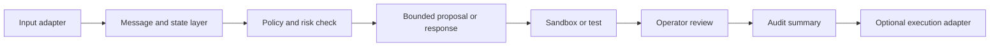

<!-- # ⭐ 修改開始 ⭐ -->
# Architecture Direction

Languages: **English** | [繁體中文](ARCHITECTURE_OVERVIEW.zh-TW.md)

This document describes a public-safe architecture direction. It is not a statement that every layer is complete, integrated, or available in this repository.

## Design Goal

PHINIX explores a local-first agent architecture in which requests, context, policy decisions, bounded proposals, validation, and operator review remain distinguishable.



The execution adapter is intentionally last. Its presence in the diagram does not mean that device control or deployment is enabled.

## Layer Responsibilities

### Input adapters

Accept text, voice, companion, viewer, or future device input without moving high-risk decisions into the client.

### Message and state

Carry traceable events, session context, deferred work, and bounded status summaries.

### Policy and risk

Classify requests, deny unsafe actions, and decide whether a request may proceed to a proposal or sandbox.

### Proposal and validation

Represent intended work, scope, tests, rollback expectations, and validation results before any higher-risk execution.

Private engineering also explores a bounded capability catalog, local evidence retrieval, governed memory persistence, and sandbox coding review. These components do not imply that arbitrary tools or user data are available to the runtime.

### Review and audit

Keep operator decisions and evidence separate from automatic execution. Public summaries must not expose private logs or operator data.

### Execution adapters

Remain optional, narrow, and separately gated. Device-specific paths, credentials, and hard real-time control should not be placed in this public repository.

## Current Implementation Truth

| Architecture element | Current public statement |
|---|---|
| Abstract schemas | Present in this repository as documentation |
| Private modules and tests | Exist in the private engineering repository |
| Agent capability control | Bounded private implementation and targeted tests; general competence is unproven |
| Local evidence and memory | Private local-index, connector, persistent-store, and synthetic restart checks; real-user encrypted durability is unproven |
| Companion and wearable adapters | Selected controlled relay evidence plus first-leg pinned-transport implementation/build checks; live pinned ingress, cable-free operation, and dual-leg hardened transport are unproven |
| Vision adapter | Selected bounded single-frame evidence; general visual understanding is unproven |
| End-to-end integration | Partially evidenced in controlled cases; not proven as a whole |
| Public runnable system | Not provided |
| Hardware or production operation | Not established |

## Engineering Boundary

Higher-risk work should follow:

```text
request
-> policy check
-> bounded proposal
-> sandbox or test
-> operator decision
-> separately authorized adapter
-> audit
```

This is a design rule, not evidence that the full sequence is currently available to public users.
<!-- # ⭐ 修改結束 ⭐ -->
