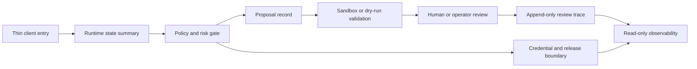

<!-- # ⭐ 修改開始 ⭐ -->
# Architecture Overview

Languages: **English** | [繁體中文](ARCHITECTURE_OVERVIEW.zh-TW.md)

This document describes only the public-safe architecture. It does not include private deployment details, device bridge configuration, credentials, full audit artifacts, or local maintenance data.

## Core Concept

PHINIX is a local-first governed agent runtime. The focus is not a single response, but a controlled process for long-horizon state, tool use, proposals, validation, human review, and audit.

## Public Architecture Flow



The diagram is intentionally high-level. It shows the governed shape of the runtime without exposing private implementation paths.

## Public Architecture Layers

### 1. Client entry layer

Responsibilities:

- Receive requests from text, voice, viewer, companion, or wearable entry points
- Display controlled results
- Stay thin-client by design

This layer should not make high-risk decisions directly.

### 2. Runtime state layer

Responsibilities:

- Manage sessions
- Maintain short-term events and state snapshots
- Track stuck issues, deferred work, and review items
- Turn background state into observable data

### 3. Policy and proposal layer

Responsibilities:

- Classify request risk
- Enforce non-harm semantic boundaries before high-risk execution can be considered
- Build engineering proposals
- Mark forbidden modification scope
- Decide whether a task may enter sandbox validation
- Attach rollback, test, and audit requirements

### 4. Sandbox validation layer

Responsibilities:

- Dry-run
- Worktree validation
- Patch validation
- Test execution
- Local branch materialization
- Private audit

This layer is not production approval.

### 5. Human-supervised operating layer

Responsibilities:

- Record review decisions
- Represent approval, rejection, and follow-up as explicit state
- Preserve append-only review traces
- Keep operator decisions separate from automatic execution

This layer does not expose private console content.

### 6. Read-only observability layer

Responsibilities:

- Display bounded health and readiness summaries
- Expose stats-only status
- Avoid full audit disclosure
- Avoid run, restore, push, merge, or device-control actions

## Public Interface Primitives

The public repository can safely discuss the following primitives:

- `runtime_state_summary`
- `proposal_record`
- `review_journal_entry`
- `model_eval_summary`
- `credential_boundary_summary`

These schemas describe public-safe shape only. They are not a deployment contract for the private runtime.

## Stuck Issue Queue

PHINIX treats unresolved issues as trackable state rather than one-off errors.

This allows the system to:

- Record where a failure happened
- Record what was already attempted
- Revisit the issue when new context appears
- Surface low-interruption reminders at the right time

## Proactive Behavior

Proactivity should not become noise.

A healthy flow is:

1. Generate a background candidate
2. Convert it into a reviewable item
3. Apply policy and cooldown
4. Let the user decide whether to expand it

## Embodiment Boundary

For future device integrations, PHINIX is better positioned as:

- memory
- context
- governance
- risk review
- proposal generation
- audit

It should not replace low-level controllers or hard real-time control loops.

## Engineering Rule

High-risk capabilities should follow:

```text
proposed action
-> policy check
-> dry-run or simulation
-> human/operator gate
-> execution adapter
-> audit
```

Design-only notes, memory policies, and speculative capability ideas should remain human-readable governance material until a separate gated phase implements, tests, and documents runtime behavior.
<!-- # ⭐ 修改結束 ⭐ -->
