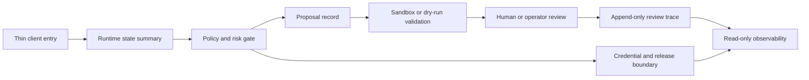

<!-- # ⭐ 修改開始 ⭐ -->
# Architecture Overview

Languages: [English](ARCHITECTURE_OVERVIEW.md) | **繁體中文**

這份文件只描述適合公開討論的高層架構，不包含 private deploy 細節、裝置橋接設定、憑證、完整審計產物或本機維護資料。

## 核心概念

PHINIX 是 local-first governed agent runtime。重點不是單次回覆，而是面向 long-horizon state、tool use、proposal、validation、human review 與 audit 的受控流程。

## 公開架構流程



這張圖刻意維持高層次，只呈現 runtime 的治理形狀，不揭露 private implementation paths。

## 公開架構層

### 1. Client entry layer

職責：

- 接收 text、voice、viewer、companion 或 wearable 入口請求
- 顯示受控結果
- 設計上保持 thin-client

此層不應直接做高風險決策。

### 2. Runtime state layer

職責：

- 管理 sessions
- 維護短期 events 與 state snapshots
- 追蹤 stuck issues、deferred work 與 review items
- 將背景狀態轉成可觀測資料

### 3. Policy and proposal layer

職責：

- 分類 request risk
- 在考慮高風險 execution 前，先執行 non-harm semantic boundaries
- 建立 engineering proposals
- 標記 forbidden modification scope
- 判斷 task 是否可進入 sandbox validation
- 附上 rollback、test 與 audit requirements

### 4. Sandbox validation layer

職責：

- Dry-run
- Worktree validation
- Patch validation
- Test execution
- Local branch materialization
- Private audit

此層不是 production approval。

### 5. Human-supervised operating layer

職責：

- 記錄 review decisions
- 將 approval、rejection 與 follow-up 表示成明確狀態
- 保留 append-only review traces
- 將 operator decision 與 automatic execution 分離

此層不公開 private console content。

### 6. Read-only observability layer

職責：

- 顯示 bounded health 與 readiness summaries
- 暴露 stats-only status
- 避免公開完整 audit
- 避免 run、restore、push、merge 或 device-control action

## 公開介面原語

公開 repository 可安全討論下列 primitives：

- `runtime_state_summary`
- `proposal_record`
- `review_journal_entry`
- `model_eval_summary`
- `credential_boundary_summary`

這些 schema 只描述 public-safe shape，不是 private runtime 的 deployment contract。

## Stuck issue queue

PHINIX 將 unresolved issues 視為可追蹤狀態，而不是一次性錯誤。

這讓系統可以：

- 記錄 failure 發生位置
- 記錄已嘗試過的處理
- 在新 context 出現時重新檢視
- 在合適時機提出低干擾提醒

## Proactive behavior

Proactivity 不應變成噪音。

健康流程：

1. 產生 background candidate
2. 轉成 reviewable item
3. 套用 policy 與 cooldown
4. 由使用者決定是否展開

## Embodiment boundary

對未來裝置整合而言，PHINIX 更適合作為：

- memory
- context
- governance
- risk review
- proposal generation
- audit

它不應取代 low-level controller 或 hard real-time control loop。

## Engineering rule

高風險能力應遵循：

```text
proposed action
-> policy check
-> dry-run or simulation
-> human/operator gate
-> execution adapter
-> audit
```

Design-only notes、memory policies 與 speculative capability ideas 應保持為 human-readable governance material，直到另開 gated phase 完成 runtime behavior 的實作、測試與文件化。
<!-- # ⭐ 修改結束 ⭐ -->
