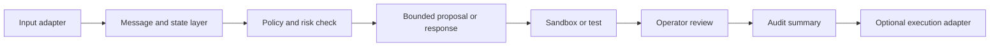

<!-- # ⭐ 修改開始 ⭐ -->
# 架構方向

Languages: [English](ARCHITECTURE_OVERVIEW.md) | **繁體中文**

這份文件只描述適合公開的架構方向，不代表每一層都已完成、整合或存在於這個 repository。

## 設計目標

PHINIX 探索一種 local-first agent 架構，讓 request、context、policy decision、有限範圍 proposal、validation 與 operator review 保持可區分。



Execution adapter 刻意放在最後。它出現在圖中，不代表已啟用裝置控制或部署能力。

## 各層職責

### Input adapter

接收 text、voice、companion、viewer 或未來裝置輸入，但不把高風險決策移到 client。

### Message and state

傳遞可追蹤事件、session context、deferred work 與有限狀態摘要。

### Policy and risk

分類 request、拒絕不安全行動，並判斷 request 是否可進入 proposal 或 sandbox。

### Proposal and validation

在任何較高風險執行前，先表示預定工作、scope、test、rollback expectation 與 validation result。

私人工程也探索 bounded capability catalog、本機證據 retrieval、受治理的記憶持久化與 sandbox coding review。這些元件不代表 runtime 已能任意使用工具或使用者資料。

### Review and audit

將 operator decision 與證據和自動執行分開。公開摘要不得揭露私有 log 或 operator data。

### Execution adapter

保持可選、狹窄且另行 gated。裝置專屬路徑、憑證與 hard real-time control 不應放入這個公開 repository。

## 目前實作事實

| 架構元素 | 目前公開說法 |
|---|---|
| 抽象 schema | 以文件形式存在於這個 repository |
| 私有模組與測試 | 存在於私人工程 repository |
| Agent 能力控制 | 私有端有 bounded 實作與針對性測試；一般能力尚未證實 |
| 本機證據與記憶 | 私有端有本機索引、connector、持久化 store 與 synthetic restart 檢查；真實資料的加密耐久性尚未證實 |
| Companion 與穿戴 adapter | 有部分受控 relay 與第一段 pinned transport 實作/build 證據；pinned ingress live、cable-free 與雙段 hardened transport 尚未證實 |
| Vision adapter | 有特定 bounded 單幀證據；一般視覺理解尚未證實 |
| 端到端整合 | 部分受控情境有證據；整體尚未證實 |
| 公開可執行系統 | 尚未提供 |
| 硬體或正式環境運作 | 尚未建立 |

## 工程邊界

較高風險工作應遵循：

```text
request
-> policy check
-> bounded proposal
-> sandbox or test
-> operator decision
-> separately authorized adapter
-> audit
```

這是設計規則，不是完整流程已提供給公開使用者的證據。
<!-- # ⭐ 修改結束 ⭐ -->
