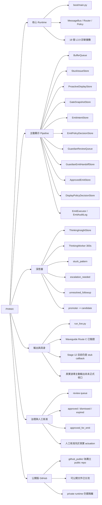

# ⭐ 修改開始 ⭐
# PHINIX 能力盤點與規劃完成度報告

- 日期：2026-04-30
- 範圍：`D:\Phinix` 現況盤點 + `github_public/` 公開版評估
- 依據：目前 runtime 接線、`boot/main.py`、`sandbox/thinking/`、`sandbox/proactive_display/`、`tests/`

## 一句話結論

PHINIX 目前已經不是單純的聊天代理，而是具備「本地主權 runtime + 主動顯示 pipeline + 深思層 + actor stub 閉環」的雛形主腦。

若只看目前已接進 runtime 的核心 companion pipeline，完成度約 **82%**。  
若以整體北極星規劃（含真實具身輸出、多通道 commander、OpenClaw 深綁、長期 cognition）估算，完成度約 **66%**。

## 1. 目前能力盤點

### 1.1 已整合到 runtime 的核心能力

1. `L0-L3` 核心骨架已成立。
   - `boot/main.py` 已完成啟動序列、Bus、Router、Policy、Logger 接線。
   - `ResumeManager`、`SearchHandler`、`WaveguideHandler`、`LLMRouter`、`PolicyHandler` 均已有既有基礎。

2. `L3.9` 已形成長鏈條可觀測層。
   - 目前有 **18 個診斷變數**。
   - `DrainWorker` 已有 **12 個 stage**。
   - `ThinkingWorker` 已作為第二條背景循環併行運作。

3. 主動顯示 pipeline 已形成資料閉環。
   - `BufferQueue`
   - `StuckIssueStore`
   - `ProactiveDisplayStore`
   - `GateSnapshotStore`
   - `EmitIntentStore`
   - `EmitPolicyDecisionStore`
   - `GuardianReviewQueue`
   - `GuardianEmitHandoffStore`
   - `ApprovedEmitStore`
   - `DisplayPolicyDecisionStore`
   - `EmitAuditLog`

4. 深思層已形成第二循環。
   - `ThinkingContext`
   - `ThinkingInsight`
   - `ThinkingInsightStore`
   - `ThinkingWorker`
   - `build_candidates_from_insights()`
   - 深思結果已可重新促進回 `ProactiveDisplayCandidate`

5. 目前 actor 閉環已成立，但仍是 `stub callback`。
   - `Stage 12` 會讀取 `EMIT_NOW`
   - 透過 `EmitExecutor` 執行 `text_callback`
   - 成功後寫入 `EmitAuditLog`
   - 並把來源 candidate 回寫為 `emitted`
   - 成功路徑的 candidate emission reconciliation 已完成第一版

6. 測試基線穩定。
   - `tests/` 目前回歸為 **326/326**
   - `BO-20` 已覆蓋深思層 promotion runtime 接線
   - `candidate emission reconciliation` runtime 測試已成立

### 1.2 已存在但仍偏 sandbox / stub 的能力

1. Search 已有能力，但仍偏 `sandbox_verified`。
   - Brave Search 路徑存在
   - 目前仍以 `STUB` 為主要驗證模式

2. Real output 與主動顯示尚未完全收口。
   - `run_live.py` 與波導 Route C 已存在
   - 但 `Stage 12` 目前在 `boot/main.py` 仍採 `stub_text_callback`
   - 代表 observer/actor pipeline 尚未正式接上真實波導輸出

3. 深思層已能回流候選，但還不是完整長期認知系統。
   - 已有 `stuck_pattern`
   - 已有 `escalation_needed`
   - 已有 `unresolved_followup`
   - 但尚未形成更高階的長期目標維持、跨日研究計畫、OpenClaw 深綁執行面

### 1.3 仍屬介面存在或規劃中能力

1. `Vision Observer` 仍未進 runtime 主路徑。
2. `Device Screenshot / HUD` 仍未形成可驗證的 production pipeline。
3. `OpenClaw 深度綁定` 目前屬對齊方向，不是 repo 內已落地事實。
4. `多通道 commander`（LINE / 面板 / 真正外部控制台）仍未完成主整合。
5. `低風險真實 actuation` 仍未成為 production-ready 功能。

## 2. 目前 runtime 心智圖

## 3. 規劃完成度估算

### 3.1 估算方法

這不是自動計算數字，而是基於以下事實做加權估算：

1. 是否已接進 `boot/main.py` 主 runtime
2. 是否已有測試閉環
3. 是否仍是 `stub / sandbox / interface_only`
4. 是否已形成「資料流 + 治理流 + 輸出流」完整鏈條
5. 是否已達到北極星規劃中的真實部署狀態

### 3.2 雙指標結論

| 指標 | 估算 | 說明 |
|------|------|------|
| 核心 companion pipeline 完成度 | **82%** | runtime、proactive pipeline、thinking loop、audit log、candidate promotion 已大致閉環；剩主動真實輸出與 terminal state 收口 |
| 北極星整體規劃完成度 | **66%** | 仍缺真實波導主動輸出、OpenClaw 深綁、多通道 commander、完整 embodied layer、長期 cognition 擴展 |

### 3.3 分項觀察

| 面向 | 估算 | 判斷 |
|------|------|------|
| Public-safe 基礎文件 | 90% | `github_public/` 已成形，public/private 邊界清楚 |
| 核心 runtime 基礎 | 85% | 啟動、Bus、Policy、Router、Logger、L3.9 接線已很完整 |
| 主動顯示 pipeline | 88% | 從 buffer 到 approved emit 幾乎完整，治理鏈明確 |
| Actor / audit 閉環 | 60% | stub callback 閉環已成立，但仍未正式切到真實波導 |
| 深思層 | 72% | insight 生成、background worker、promotion 已完成第一版 |
| 具身 / 多通道 / OpenClaw | 40% | 方向清楚，但 repo 內尚未形成 production 級整合事實 |

## 4. GitHub 可更新上傳內容評估

### 4.1 可以直接上傳到 public repo 的內容

1. `github_public/` 內的公開文件
2. 這份報告
3. public-safe 的架構說明、scope、roadmap、contributing、call for experts
4. 不含設備控制細節的 Mermaid 架構圖

### 4.2 可以整理後再上傳的內容

1. `sandbox/thinking/`
   - 純資料契約
   - `ThinkingWorker`
   - promoter 類邏輯

2. `sandbox/proactive_display/` 的純契約與 store 類
   - `approved_emit.py`
   - `display_policy.py`
   - `emit_executor.py`
   - `review.py`
   - `review_handoff.py`
   - `intent.py`
   - `policy.py`
   - `snapshot.py`

3. `sandbox/stuck_queue/` 的模型與 store

4. `core/bus.py`、`core/message.py` 這類純核心抽象

### 4.3 目前不建議直接公開的內容

1. `boot/run_live.py`
2. `boot/run_phinix.py`
3. `capabilities/output/*`
4. `capabilities/audio/*`
5. `.claude/*`
6. 任何 bridge credentials、API keys、設備 IP、adb 實機控制細節
7. APK、vendor binaries、reverse-engineered artifacts

## 5. 這次公開版上傳建議

### 建議立即上傳

1. 本報告
2. 既有 `github_public/` 中的中英文 public-safe 文件

### 建議下一批再公開

1. `sandbox/thinking/` 的純資料層與 worker
2. `sandbox/proactive_display/` 的純契約與政策層
3. `sandbox/stuck_queue/` 的資料模型

### 建議暫緩公開

1. 實機波導接線
2. 音訊 live loop 實作細節
3. 任何可被用來直接控制設備的 runtime wiring

## 6. 我對目前狀態的判斷

PHINIX 現在最強的地方，不是「功能很多」，而是它已經有一條非常清楚的結構：

1. 先觀測
2. 再整理成候選
3. 再進治理
4. 再進核准
5. 再進顯示政策
6. 再進 actor / audit
7. 再由深思層反向補強候選

這讓它已經很接近「有節奏、有治理、會回頭思考」的 agent core。  
現在距離真正完成，最大缺口不是再多堆幾個 store，而是把以下三件事做乾淨：

1. `Stage 12` 正式接上真實波導輸出
2. candidate terminal states 全部收口
3. OpenClaw / commander / embodiment 進入真實可用整合

## 7. 本次處理結果

1. 已完成這份公開版報告
2. 已確認 `github_public/` 是獨立 Git repo
3. 已確認其 remote 指向 `origin = https://github.com/Architect-RR/phinix-public.git`
4. 可直接把這份報告推到 public repo
# ⭐ 修改結束 ⭐
